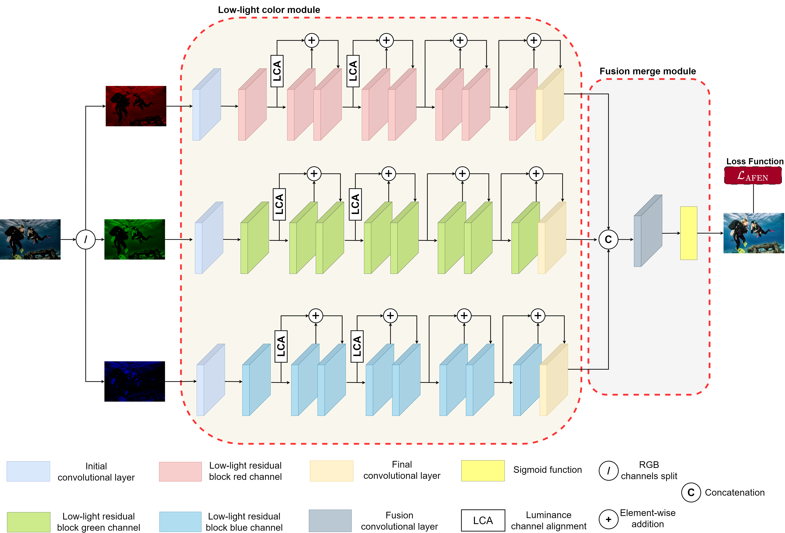

# AFEN: Multi-Channel Residual Blocks for Enhanced Low-Light Underwater Vision

## Overview

This repository contains the source code and associated materials for the paper titled **AFEN: Multi-Channel Residual Blocks for Enhanced Low-Light Underwater Vision**. The aim of this research is the visual enhancement of low-light underwater images. This paper is currently under review in the journal [IEEE Transactions on Image Processing](https://ieeexplore.ieee.org/xpl/RecentIssue.jsp?punumber=83).

## Project Status

The project is currently in preparation for release. We are finalizing the codebase and documentation, and the repository will be made public shortly.
